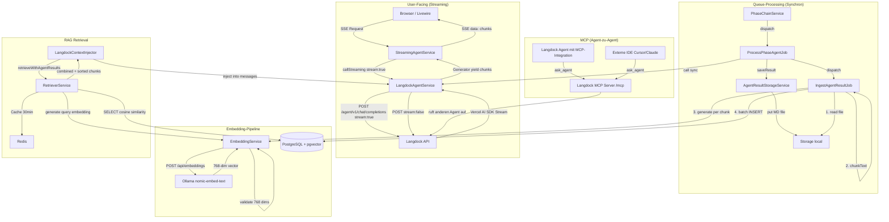
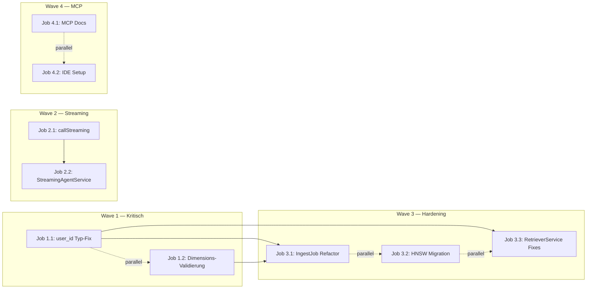

# TARGET_ARCHITECTURE v2.0

> Stand: 2026-04-08 | Status: Entwurf nach Phase A–D Abschluss + Turbulenz-Analyse

---

## 1. Kontext und Ziel

Das System ist eine Laravel-basierte Forschungsplattform mit 8-Phasen-Workflow für systematische Reviews. Agenten (via Langdock API) bearbeiten Phasen automatisch, Ergebnisse werden als Markdown gespeichert und per Embedding-Pipeline in pgvector indiziert. Ein RAG-Retriever liefert Kontext für Folgephasen.

**Ziel dieser Iteration:**
- Streaming-Antworten für User-facing Chat (echtes SSE statt Fake-Streaming)
- Typ-Konsistenz bei `user_id` über alle Schichten
- Robuste Embedding-Pipeline mit Dimensions-Validierung
- Saubere Trennung von Direct API (Streaming) vs. MCP (Agent-Orchestrierung)
- Performance-Optimierung der Vektor-Suche (HNSW statt IVFFlat)

---

## 2. IST vs. SOLL

| Aspekt | IST | SOLL |
|---|---|---|
| Streaming | Fake-SSE: komplette Antwort holen, dann zeichenweise ausgeben | Echtes Streaming via `stream: true` auf Langdock Direct API |
| `user_id` Typ | UUID in Migration, `int` in Services, `string` in Job | Einheitlich `string` (UUID) überall, oder `int` überall — eine Entscheidung |
| Embedding-Dimension | Keine Validierung, `validate()` kann Vektor verkürzen | Explizite 768-Dimensions-Prüfung in `EmbeddingService` |
| Vektor-Index | IVFFlat mit `lists=100` auf leerer Tabelle | HNSW-Index (funktioniert auch bei leerer Tabelle) |
| Idempotenz-DELETE | Nur nach `source_file`, ohne User-Isolation | DELETE mit `workspace_id + user_id + source_file` |
| Cache-Key | Ohne `workspace_id` | Mit `workspace_id` |
| `retrieve()` vs. `retrieveWithAgentResults()` | Beide aktiv, keine Deprecation | `retrieve()` deprecated, alle Caller auf `retrieveWithAgentResults()` |
| Transaktion in IngestJob | HTTP-Calls (Ollama) innerhalb DB-Transaktion | Embeddings außerhalb sammeln, dann Batch-Insert in Transaktion |
| MCP-Nutzung | Unklar / nicht integriert | MCP als Agent-zu-Agent-Tool + externe IDE-Anbindung |

---

## 3. Komponentenbeschreibung

### 3.1 Geändert

#### `LangdockAgentService.php`
- **Änderung:** Neue Methode `callStreaming()` mit `'stream' => true` im Request-Body und Guzzle `withOptions(['stream' => true])`
- **Warum:** F6 — Fake-Streaming beseitigen, echtes SSE ermöglichen
- **Schnittstelle:** Gibt `\Generator` zurück statt `array`

#### `StreamingAgentService.php`
- **Änderung:** `stream()` nutzt `callStreaming()` statt `call()`, reicht Chunks direkt durch
- **Warum:** F6 — Time-to-First-Token für User-UX
- **Schnittstelle:** SSE-Response bleibt gleich, aber Chunks kommen inkrementell

#### `EmbeddingService.php`
- **Änderung:** `validate()` prüft nach Filterung `count($validated) === self::EXPECTED_DIMENSIONS` (768)
- **Warum:** F2 — pgvector wirft Fehler bei falscher Dimension
- **Schnittstelle:** Neue Konstante `EXPECTED_DIMENSIONS = 768`

#### `IngestAgentResultJob.php`
- **Änderung 1:** Embeddings außerhalb der Transaktion generieren, dann Batch-Insert
- **Änderung 2:** DELETE mit `workspace_id + user_id` Filter
- **Änderung 3:** `user_id` Typ angleichen (siehe offene Entscheidung)
- **Warum:** F5 (Transaktion), F8 (Isolation), F1 (Typ-Mismatch)

#### `RetrieverService.php`
- **Änderung 1:** `retrieve()` als `@deprecated` markieren
- **Änderung 2:** Cache-Key um `workspace_id` erweitern
- **Warum:** F7 (Konsistenz), F4 (Cache-Isolation)

#### `2026_04_08_…_create_agent_result_embeddings_table.php`
- **Änderung 1:** `user_id` Typ angleichen (UUID oder unsignedBigInteger)
- **Änderung 2:** IVFFlat-Index → HNSW-Index
- **Warum:** F1 (Typ-Mismatch), F3 (leere Tabelle)

#### `AgentResultStorageService.php`
- **Änderung:** `int $userId` → `string $userId` (oder umgekehrt, je nach Entscheidung)
- **Warum:** F1 — Typ-Konsistenz

#### `ChatService.php`
- **Änderung:** `int $userId` → `string $userId` (oder umgekehrt)
- **Warum:** F1 — Typ-Konsistenz

### 3.2 Neu

Keine neuen Dateien nötig. Alle Änderungen betreffen bestehende Komponenten.

### 3.3 Entfernt

Keine Löschungen. `retrieve()` wird deprecated, aber nicht entfernt (Abwärtskompatibilität).

---

## 4. Datenfluss-Diagramm (SOLL)

---

## 5. Sicherheitsverbesserungen

| # | Maßnahme | Betrifft |
|---|---|---|
| S1 | DELETE in IngestJob filtert nach `workspace_id + user_id + source_file` | IngestAgentResultJob |
| S2 | Cache-Key enthält `workspace_id` gegen Cross-Workspace-Leaks | RetrieverService |
| S3 | `user_id` Typ einheitlich — verhindert Cast-Fehler und potentielle Query-Manipulation | Migration, alle Services |

---

## 6. Migrationsplan

### Wave 1 — Kritische Fixes (parallel ausführbar)

| Job | Inhalt | Dateien |
|---|---|---|
| Job 1.1 | `user_id` Typ-Entscheidung + Migration + Services angleichen | Migration, AgentResultStorageService, ChatService, IngestAgentResultJob |
| Job 1.2 | Dimensions-Validierung in EmbeddingService | EmbeddingService |

### Wave 2 — Streaming-Umbau (sequenziell)

| Job | Inhalt | Dateien |
|---|---|---|
| Job 2.1 | `callStreaming()` in LangdockAgentService | LangdockAgentService |
| Job 2.2 | StreamingAgentService auf echtes Streaming umbauen | StreamingAgentService |

### Wave 3 — Pipeline-Hardening (parallel)

| Job | Inhalt | Dateien |
|---|---|---|
| Job 3.1 | IngestJob: Embeddings außerhalb Transaktion + DELETE mit User-Isolation | IngestAgentResultJob |
| Job 3.2 | Migration: IVFFlat → HNSW | Neue Migration |
| Job 3.3 | RetrieverService: Cache-Key fix + `retrieve()` deprecation | RetrieverService |

### Wave 4 — MCP-Integration (optional, parallel)

| Job | Inhalt | Dateien |
|---|---|---|
| Job 4.1 | Dokumentation: MCP als Agent-zu-Agent-Integration einrichten | README / Docs |
| Job 4.2 | Cursor/IDE-Setup-Anleitung für Forscher | Docs |

---

## 7. Offene Entscheidungen

| # | Entscheidung | Optionen | Empfehlung |
|---|---|---|---|
| OE1 | `user_id` Typ | A) UUID überall, B) Integer überall | **B) Integer** — Laravel User-Model nutzt Auto-Increment, Migration auf `unsignedBigInteger` ändern |
| OE2 | `retrieve()` entfernen oder behalten | A) Deprecated + Wrapper, B) Sofort entfernen | **A) Deprecated** — Wrapper der intern `retrieveWithAgentResults()` aufruft |
| OE3 | Credit-Tracking bei Streaming | A) Am Stream-Ende parsen, B) Nachträglicher API-Call | **A) Stream-Ende** — letzter Chunk enthält Usage-Info im Vercel-Format |
| OE4 | REINDEX-Strategie für HNSW | A) Kein Rebuild nötig (HNSW ist selbst-balancierend), B) Scheduled VACUUM | **A) Kein Rebuild** — HNSW braucht im Gegensatz zu IVFFlat kein Reindexing |

---

## Anhang: Job-Abhängigkeitsdiagramm

**Legende:** `→` = blockiert durch, `-.->` = kann parallel laufen

---

## Anhang: Detaillierte Sub-Job-Spezifikationen

### Job 1.1 — `user_id` Typ-Konsistenz

**Was:** Entscheidung für Integer-Typ, Migration ändern, alle Services angleichen
**Input-Files:**
- `2026_04_08_100000_create_agent_result_embeddings_table.php`
- `AgentResultStorageService.php`
- `ChatService.php`
- `IngestAgentResultJob.php`
- `LangdockContextInjector.php` (Referenz für `isValidIdentifier()`)

**Output-Files:**
- Neue Migration `2026_04_08_100001_fix_user_id_type.php`
- Geändert: `AgentResultStorageService.php` (`int $userId` bleibt, Migration wird angepasst)
- Geändert: `IngestAgentResultJob.php` (`string $userId` → `int $userId`)

**Acceptance Criteria:**
- [ ] Migration ändert `user_id` von `uuid` auf `unsignedBigInteger` (oder alle Services auf `string`)
- [ ] `IngestAgentResultJob` hat gleichen Typ wie `AgentResultStorageService`
- [ ] `php artisan migrate` läuft fehlerfrei
- [ ] INSERT in `agent_result_embeddings` mit echtem User-ID funktioniert

**Kontextgröße:** ~250 Zeilen
**Difficulty:** 2

---

### Job 1.2 — Dimensions-Validierung

**Was:** `EmbeddingService::validate()` prüft exakte Dimension nach Filterung
**Input-Files:**
- `EmbeddingService.php`

**Output-Files:**
- Geändert: `EmbeddingService.php`

**Acceptance Criteria:**
- [ ] Konstante `EXPECTED_DIMENSIONS = 768` existiert
- [ ] `validate()` wirft `RuntimeException` wenn `count !== 768`
- [ ] Unit-Test: Vektor mit 768 Werten → OK
- [ ] Unit-Test: Vektor mit 767 Werten (nach NaN-Filter) → Exception

**Kontextgröße:** ~100 Zeilen
**Difficulty:** 1

---

### Job 2.1 — `callStreaming()` Methode

**Was:** Neue Methode in `LangdockAgentService` die `stream: true` setzt und einen Generator zurückgibt
**Input-Files:**
- `LangdockAgentService.php`
- `LangdockContextInjector.php` (Referenz)

**Output-Files:**
- Geändert: `LangdockAgentService.php`

**Acceptance Criteria:**
- [ ] `callStreaming(agentId, messages, timeout, context): \Generator` existiert
- [ ] Request-Body enthält `'stream' => true`
- [ ] Guzzle-Option `withOptions(['stream' => true])` gesetzt
- [ ] Generator yieldet String-Chunks aus dem Response-Body
- [ ] Bestehende `call()` Methode unverändert

**Kontextgröße:** ~400 Zeilen
**Difficulty:** 3

---

### Job 2.2 — StreamingAgentService echtes Streaming

**Was:** `stream()` nutzt `callStreaming()` und reicht Chunks durch
**Input-Files:**
- `StreamingAgentService.php`
- `LangdockAgentService.php` (Referenz für `callStreaming()`)

**Output-Files:**
- Geändert: `StreamingAgentService.php`

**Acceptance Criteria:**
- [ ] Kein synchroner `call()` mehr in `stream()`
- [ ] Chunks werden direkt aus Generator an SSE weitergegeben
- [ ] Response-Header: `Content-Type: text/event-stream`, `X-Accel-Buffering: no`
- [ ] Credit-Tracking am Stream-Ende (oder TODO markiert)
- [ ] Manueller Test: Erster Chunk erscheint < 2s nach Request

**Kontextgröße:** ~200 Zeilen
**Difficulty:** 2

---

### Job 3.1 — IngestJob Refactoring

**Was:** Embeddings außerhalb Transaktion sammeln, DELETE mit User-Isolation
**Input-Files:**
- `IngestAgentResultJob.php`
- `EmbeddingService.php` (Referenz)

**Output-Files:**
- Geändert: `IngestAgentResultJob.php`

**Acceptance Criteria:**
- [ ] Alle Embeddings werden in Array gesammelt BEVOR `DB::transaction()` startet
- [ ] `DB::transaction()` enthält nur DELETE + INSERT-Schleife (keine HTTP-Calls)
- [ ] DELETE filtert nach `source_file AND workspace_id AND user_id`
- [ ] Job-Timeout passt (ggf. erhöhen wegen sequenzieller Embedding-Generierung)
- [ ] Fehlerfall: Wenn Chunk 5/10 bei Embedding fehlschlägt, sind Chunks 1-4 NICHT in DB

**Kontextgröße:** ~200 Zeilen
**Difficulty:** 2

---

### Job 3.2 — HNSW-Index Migration

**Was:** Neue Migration die IVFFlat-Index droppt und HNSW-Index erstellt
**Input-Files:**
- `2026_04_08_100000_create_agent_result_embeddings_table.php` (Referenz)

**Output-Files:**
- Neue Datei: `2026_04_08_200000_switch_to_hnsw_index.php`

**Acceptance Criteria:**
- [ ] `DROP INDEX IF EXISTS agent_result_embeddings_embedding_idx`
- [ ] `CREATE INDEX ... USING hnsw (embedding vector_cosine_ops) WITH (m = 16, ef_construction = 64)`
- [ ] `down()` erstellt den alten IVFFlat-Index zurück
- [ ] Migration läuft auf leerer UND gefüllter Tabelle

**Kontextgröße:** ~50 Zeilen
**Difficulty:** 1

---

### Job 3.3 — RetrieverService Fixes

**Was:** Cache-Key mit `workspace_id`, `retrieve()` deprecated
**Input-Files:**
- `RetrieverService.php`

**Output-Files:**
- Geändert: `RetrieverService.php`

**Acceptance Criteria:**
- [ ] Cache-Key Format: `rag_cache:{workspaceId}:{projektId}:{userId}:{md5(query)}`
- [ ] `retrieve()` hat `@deprecated` PHPDoc-Tag
- [ ] `retrieve()` loggt `Log::notice('Deprecated method called')`
- [ ] Optionaler Wrapper: `retrieve()` ruft intern `retrieveWithAgentResults()` auf (wenn Parameter vorhanden)

**Kontextgröße:** ~200 Zeilen
**Difficulty:** 1

---

### Job 4.1 — MCP Agent-zu-Agent Dokumentation

**Was:** Anleitung wie man den Langdock MCP Server als Integration einrichtet
**Input-Files:** Keine Code-Files, nur Langdock Docs als Referenz

**Output-Files:**
- Neue Datei: `docs/MCP_AGENT_ORCHESTRATION.md`

**Acceptance Criteria:**
- [ ] Schritt-für-Schritt: MCP-Integration in Langdock UI anlegen
- [ ] Beispiel: Phase-3-Agent ruft Scoping-Agent via `ask_agent`
- [ ] Hinweis: MCP ist NICHT für Streaming, nur für Agent-zu-Agent

**Kontextgröße:** ~50 Zeilen
**Difficulty:** 1

---

### Job 4.2 — IDE-Setup für Forscher

**Was:** Anleitung für Cursor / Claude Desktop MCP-Anbindung
**Input-Files:** Keine

**Output-Files:**
- Neue Datei: `docs/IDE_MCP_SETUP.md`

**Acceptance Criteria:**
- [ ] JSON-Config für `claude_desktop_config.json` / `.cursor/mcp.json`
- [ ] API-Key-Beschaffung erklärt
- [ ] Beispiel-Prompts die `ask_agent` nutzen

**Kontextgröße:** ~30 Zeilen
**Difficulty:** 1

---

## Anhang: Job-Tabelle (Übersicht)

| Job | Tasks | Input-Files | Kontext | Diff. | Parallel? |
|---|---|---|---|---|---|
| 1.1 | user_id Typ-Fix | Migration, StorageService, ChatService, IngestJob | ~250 Z. | 2 | ✅ mit 1.2 |
| 1.2 | Dimensions-Validierung | EmbeddingService | ~100 Z. | 1 | ✅ mit 1.1 |
| 2.1 | callStreaming() | LangdockAgentService, ContextInjector | ~400 Z. | 3 | ❌ vor 2.2 |
| 2.2 | StreamingAgent Umbau | StreamingAgentService, LangdockAgentService | ~200 Z. | 2 | ❌ nach 2.1 |
| 3.1 | IngestJob Refactor | IngestAgentResultJob, EmbeddingService | ~200 Z. | 2 | ✅ nach 1.1+1.2 |
| 3.2 | HNSW Migration | alte Migration (Ref) | ~50 Z. | 1 | ✅ mit 3.1, 3.3 |
| 3.3 | RetrieverService Fixes | RetrieverService | ~200 Z. | 1 | ✅ mit 3.1, 3.2 |
| 4.1 | MCP Docs | — | ~50 Z. | 1 | ✅ mit allem |
| 4.2 | IDE Setup Docs | — | ~30 Z. | 1 | ✅ mit allem |

**Gesamt-Kontext (alle Jobs separat):** ~1.480 Zeilen
**Monolith-Alternative:** ~2.800 Zeilen (alle Dateien gleichzeitig)
**Ersparnis:** ~47% weniger Kontext pro Agent-Call
